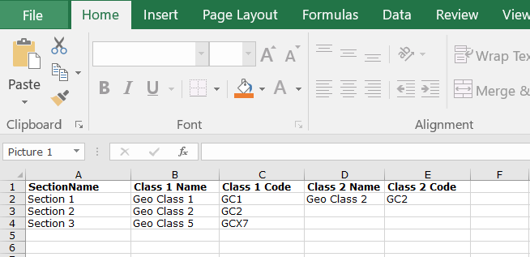
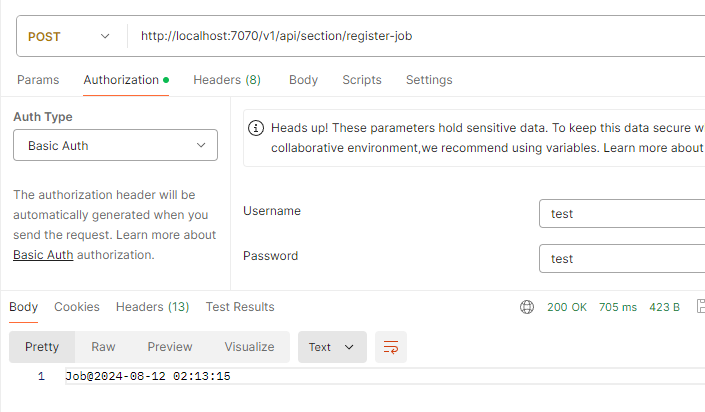
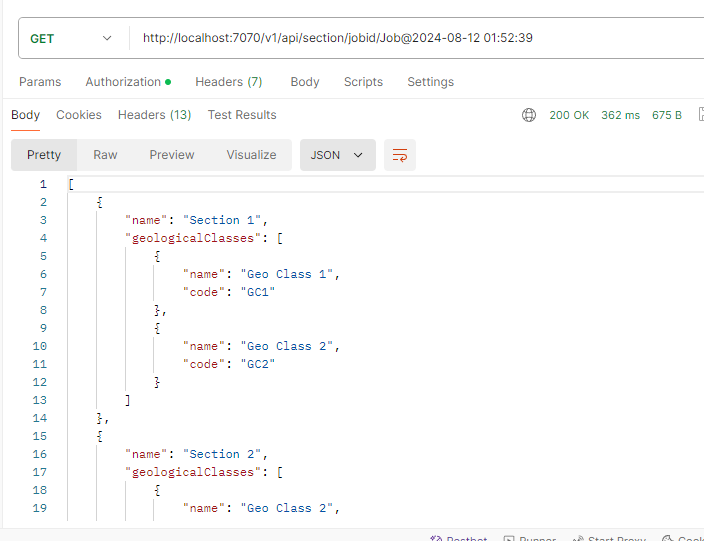
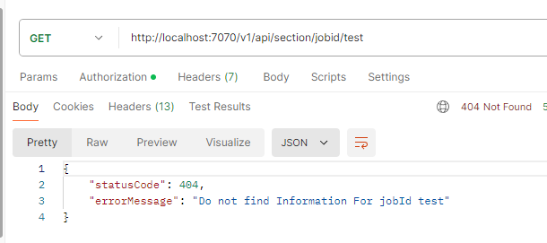
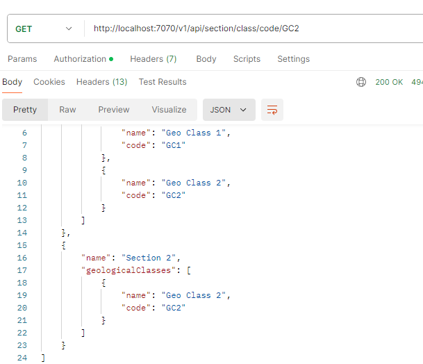
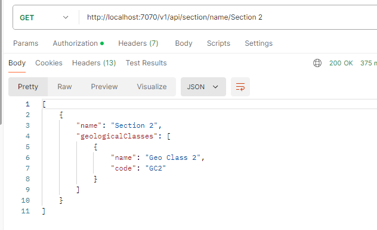
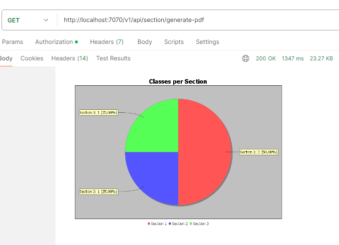
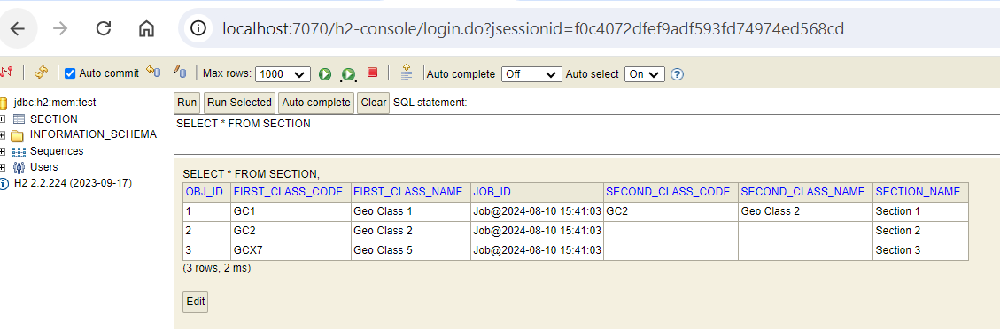
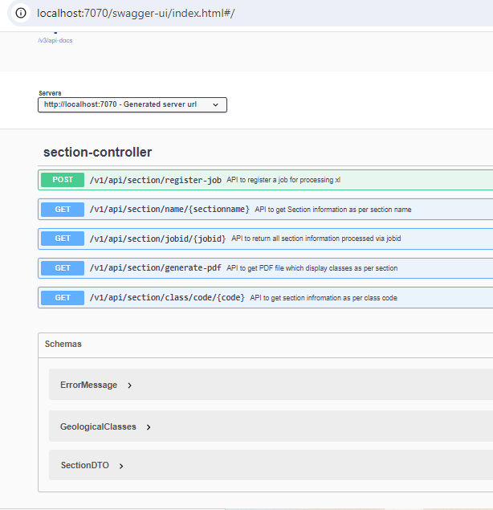

API is created, and below is some information about API :

1) Application developed in SpringBoot , it runs on port 7070 and it has very basic spring security enabled.
user name and pass is - test/test.

2) It has H2 DB in the background to store the xlsx information(a sample of xlsx you can find in src/test/resources folder)

(To Run this project add xlsx file in C:/strawag/test/section.xlsx location -- which you can change in application.yaml file)

3) Logs we can find inside the log folder , and older logs of the application would be added inside the oldlogs folder.

4) Configuration of DB and file location is externalized inside application.yaml

5) I used swagger for basic documentation of the Api.

  
Assignment : I tried to complete all points which were mentioned however, due to time constraint may be something left.

Below are the APIs exposed :

a) /v1/api/section/register-job  (register async job) 

b) /v1/api/section/jobid/{jobid} - (search as per job id)

c) /v1/api/section/class/code/{codeid} - (search as per code id)

d) /v1/api/section/name/{sectionname} -  (search as per section name)

e)  /api/generate-pdf - (it will generate a pdf file of a pie chart-how many classes per section)

DB Table

Swagger

